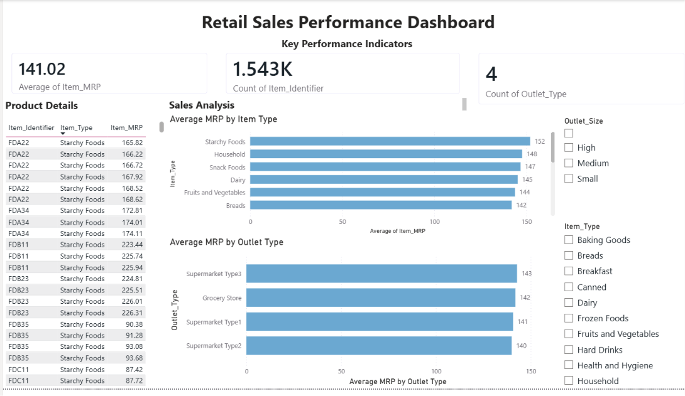

# Retail Sales Performance Dashboard

## 📊 Project Overview

An interactive retail dashboard developed using Microsoft Power BI to analyze product and outlet-level data from the Big Mart dataset.

The project focuses on data cleaning, transformation, visualization, KPI creation, and interactive dashboard design.

## 🛠️ Tools & Technologies

- Microsoft Power BI
- Power Query
- Data Visualization
- Interactive Dashboards

## 📌 Key Features

- Interactive KPI cards
- Average MRP analysis by Item Type
- Average MRP analysis by Outlet Type
- Interactive slicers for Item Type and Outlet Size
- Product details table
- Dynamic filtering across dashboard visuals
- Data cleaning and transformation using Power Query

## 🧹 Data Preparation

Power Query was used to prepare the dataset by:

- Checking data quality and missing values
- Standardizing Item Fat Content categories
- Removing duplicate records
- Reviewing and correcting data types
- Preparing the dataset for visualization

## 📈 Dashboard Components

### Key Performance Indicators

- Average Item MRP
- Total Products
- Number of Outlet Types

### Visualizations

- Average MRP by Item Type
- Average MRP by Outlet Type
- Product details table

### Filters

- Item Type
- Outlet Size

## 🎯 Learning Outcomes

Through this project, I gained practical experience in:

- Power BI dashboard development
- Power Query data cleaning
- Data visualization
- KPI creation
- Interactive filtering
- Dashboard layout and design

## 📂 Project Files

This repository contains the Power BI files created during the project:

- `Level_1.pbix` — Data understanding and import
- `Level_2.pbix` — Data cleaning and preparation
- `Level_3.pbix` — Basic visualizations
- `Level_4.pbix` — Interactivity and insights
- `Level_5.pbix` — Final dashboard
## Project Status

Completed as part of a Power BI internship project.
## 📷 Dashboard Preview

